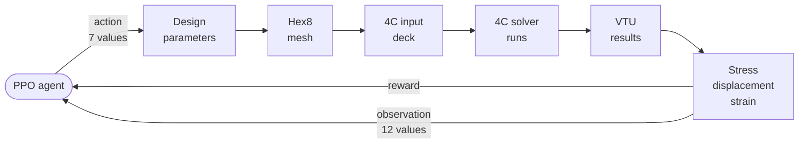

# AutoStent — reinforcement learning for autonomous stent design

[](LICENSE)

A reinforcement-learning agent designs endovascular stents by driving a real multiphysics solver —
[4C Multiphysics](https://www.4c-multiphysics.org/) — and learning from the results.

The agent proposes a design. The pipeline meshes it, runs 4C in a container, reads the stresses
back and turns them into a reward. Repeat. Everything runs behind a FastAPI service with a browser
front end, so a study can be started and watched without touching Python.


## The loop



One episode is up to 50 steps. Each step:

1. **The agent acts.** It outputs 7 numbers in [−1, 1]. Each nudges one design parameter: diameter, length, strut thickness, strut width, strut count, crown height, crown radius. Values stay inside their allowed ranges.
2. **The design becomes a mesh.** A B-spline stent is sampled into a cylindrical hex8 mesh and written as VTU.
3. **The mesh becomes a solver deck.** A 4C YAML file is generated from the same parameters — mesh, material, boundary conditions, solver settings. Nothing is hand-edited.
4. **4C runs.** As a subprocess, under a timeout, inside a container built on the official 4C image.
5. **The result is read.** The VTU output is parsed into von Mises stress, displacement, strain, and whether the run converged.
6. **The result becomes a reward.** Lower stress, displacement and strain score higher; convergence is rewarded. A failed run is data, not an exception.
7. **The agent observes.** 12 numbers come back: the 7 parameters, 3 mechanics values, and 2 convergence indicators.

| Step | Code |
|---|---|
| mesh | `railway/mesh_generator.py` |
| deck | `autostent/automation/yaml_generator.py` |
| run | `railway/Dockerfile` · `autostent/simulation/fourc_interface.py` |
| parse | `railway/vtu_parser.py` |
| reward · environment | `autostent/rl/stent_env.py` (Gymnasium) |

Agent: PPO from Stable-Baselines3.

## Does the agent learn?

Yes. PPO trained for 30,000 steps against a random-search baseline of the same per-episode budget,
evaluated over 30 episodes:


| | random search | trained PPO |
|---|---|---|
| mean episode reward | −20.6 ± 7.2 | −5.3 |
| peak von Mises stress of best design | 106 MPa | 31 MPa |

The same comparison is built into the app (`Run Comparison`), so the result is reproducible by
whoever is using it:


These figures were produced with the physics surrogate (`SimpleStentEnv` in
`railway/api_server.py`); the environment, reward and agent are the same code that runs against
the solver when the 4C container is available.

## Scope and roadmap

The loop closes against the real solver end to end; the service builds from the official 4C image
and reports solver availability (`/check-4c`); SLURM job scripts and batch sweeps are generated from
the same objects as single runs (`autostent/automation/`).

Roadmap: patient-specific device geometry (the current mesh is a simplified cylindrical hex8 model),
a superelastic Nitinol constitutive model (currently linear-elastic), contact with the arterial wall,
a crimp-and-deploy cycle, and reward weights derived from clinical endpoints.

## Running it

```bash
# surrogate physics, no solver needed
pip install -e . fastapi "uvicorn[standard]" stable-baselines3 gymnasium
python -m uvicorn railway.api_server:app --port 8080
# then open frontend/index.html and point backendUrl at http://127.0.0.1:8080

# real solver
docker build -f railway/Dockerfile -t autostent-4c .
docker run -p 8080:8080 autostent-4c
```

`notebooks/stent_rl_training.ipynb` walks through environment setup, random-search baseline, PPO
training and evaluation.

## Layout

```
autostent/      core package — geometry, rl (Gymnasium env), simulation (4C interface), automation (YAML, batch, SLURM), evaluation
railway/        FastAPI service, mesh generator, VTU parser, Dockerfile on the official 4C image
frontend/       single-page Vue + Plotly front end
notebooks/      training notebook
webviewer_deploy/  vendored 4C-Webviewer (MIT, © 4C-Webviewer Authors) used for deck visualisation
```

## License

MIT — see [LICENSE](LICENSE). The vendored `webviewer_deploy/` keeps its own MIT licence
(© 4C-Webviewer Authors). 4C Multiphysics itself is not included in this repository; the
Dockerfile pulls the official image.

## Acknowledgements

Built on [4C Multiphysics](https://github.com/4C-multiphysics/4C) and its
[webviewer](https://github.com/4C-multiphysics/4C-webviewer), Gymnasium, Stable-Baselines3 and PyVista.
