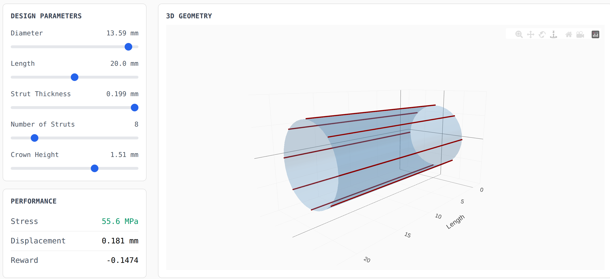
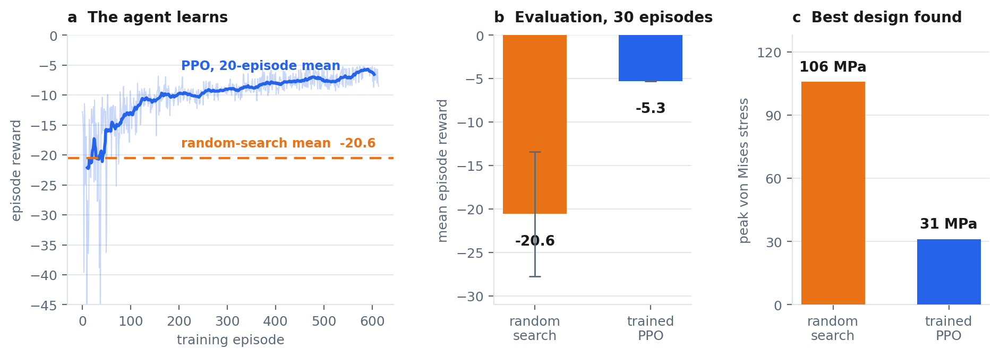
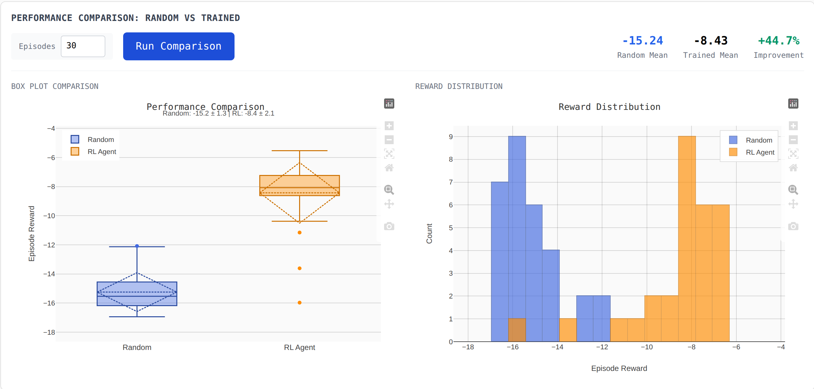

# AutoStent — reinforcement learning for autonomous stent design

[](LICENSE)

A research pipeline in which a reinforcement-learning policy designs endovascular stents by
repeatedly driving a real multiphysics solver — [4C Multiphysics](https://www.4c-multiphysics.org/) —
and learning from what comes back.

Every step of an episode turns a policy action into a parametric geometry, meshes it, writes a 4C
input deck, runs the solver in its own container, parses the VTU field output and converts the
mechanics into a reward. The loop is closed, containerised and exposed as a FastAPI service with a
browser front end, so a study can be started, given a fidelity level and watched without touching
Python.



## The loop

| Stage | What happens |
|---|---|
| Action → parameters | 7-D continuous action in [−1, 1], applied as bounded relative changes to diameter, length, strut thickness, strut width, strut count, crown height and crown radius; clipped to admissible ranges |
| Parameters → mesh | B-spline stent geometry sampled into a cylindrical hex8 mesh, written as VTU (`railway/mesh_generator.py`) |
| Mesh → input deck | 4C YAML deck generated from the same parameter objects — mesh reference, material, boundary conditions, solver settings (`autostent/automation/yaml_generator.py`) |
| Run | `fourc` executed as a subprocess under a timeout, inside an image built on `ghcr.io/4c-multiphysics/4c` (`railway/Dockerfile`) |
| Result → mechanics | VTU parsed; von Mises stress, max displacement, max principal strain, convergence status and residual norm extracted (`railway/vtu_parser.py`) |
| Mechanics → reward | Normalised weighted reward penalising stress, displacement and strain and rewarding convergence (`autostent/rl/stent_env.py`) |

Observation: 12-D (7 normalised design parameters, 3 normalised result quantities, converged flag,
residual norm). Agent: PPO from Stable-Baselines3.

## Does the agent learn?

Yes. PPO trained for 30,000 steps against a random-search baseline of the same per-episode budget,
evaluated over 30 episodes:



| | random search | trained PPO |
|---|---|---|
| mean episode reward | −20.6 ± 7.2 | −5.3 |
| peak von Mises stress of best design | 106 MPa | 31 MPa |

The same comparison is built into the app (`Run Comparison`), so the result is reproducible by
whoever is using it:



These figures were produced with the physics surrogate (`SimpleStentEnv` in
`railway/api_server.py`); the environment, reward and agent are the same code that runs against
the solver when the 4C container is available.

## Scope and roadmap

The loop closes against the real solver end to end; the service builds from the official 4C image
and reports solver availability (`/check-4c`); SLURM job scripts and batch sweeps are generated from
the same objects as single runs (`autostent/automation/`).

Roadmap: patient-specific device geometry (the current mesh is a simplified cylindrical hex8 model),
a superelastic Nitinol constitutive model (currently linear-elastic), contact with the arterial wall,
a crimp-and-deploy cycle, and reward weights derived from clinical endpoints.

## Running it

```bash
# surrogate physics, no solver needed
pip install -e . fastapi "uvicorn[standard]" stable-baselines3 gymnasium
python -m uvicorn railway.api_server:app --port 8080
# then open frontend/index.html and point backendUrl at http://127.0.0.1:8080

# real solver
docker build -f railway/Dockerfile -t autostent-4c .
docker run -p 8080:8080 autostent-4c
```

`notebooks/stent_rl_training.ipynb` walks through environment setup, random-search baseline, PPO
training and evaluation.

## Layout

```
autostent/      core package — geometry, rl (Gymnasium env), simulation (4C interface), automation (YAML, batch, SLURM), evaluation
railway/        FastAPI service, mesh generator, VTU parser, Dockerfile on the official 4C image
frontend/       single-page Vue + Plotly front end
notebooks/      training notebook
webviewer_deploy/  vendored 4C-Webviewer (MIT, © 4C-Webviewer Authors) used for deck visualisation
```

## License

MIT — see [LICENSE](LICENSE). The vendored `webviewer_deploy/` keeps its own MIT licence
(© 4C-Webviewer Authors). 4C Multiphysics itself is not included in this repository; the
Dockerfile pulls the official image.

## Acknowledgements

Built on [4C Multiphysics](https://github.com/4C-multiphysics/4C) and its
[webviewer](https://github.com/4C-multiphysics/4C-webviewer), Gymnasium, Stable-Baselines3 and PyVista.
